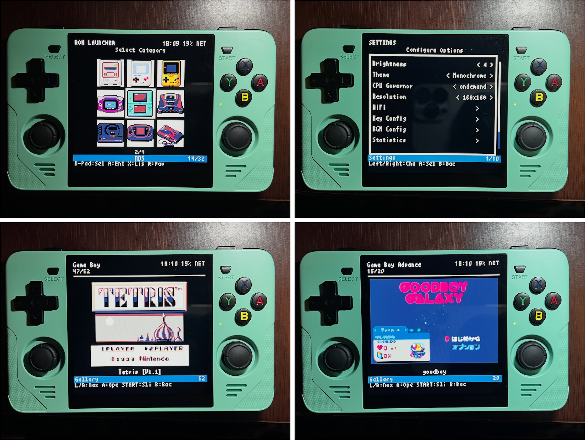
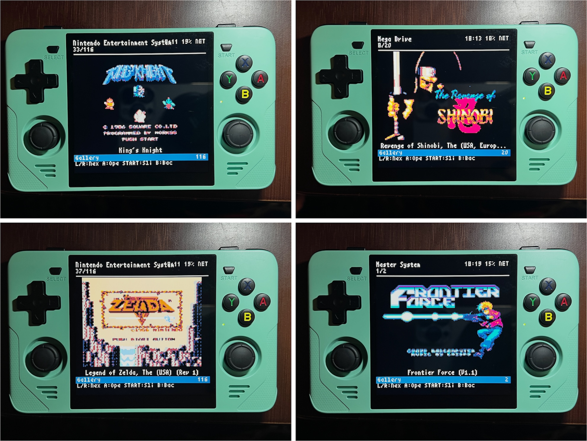

# pyxel frontend for emulator (PFE)

Pyxelで構築されたレトロスタイルのROMランチャー。複数のエミュレータとプラットフォームに対応しています。

  
  

## 機能

### コア機能
- 設定ファイルパーサー（pfe.cfg形式）
- メインメニューでのカテゴリ選択（リスト・ギャラリーモード対応）
- ROMファイル一覧とサブディレクトリ対応のブラウジング
- 入力処理（キーボード + ゲームパッド）
- RetroArch/PPSSPPでのROM実行
- 日本語テキスト対応
- スムーズなナビゲーションのためのキーリピート
- カテゴリ別カーソル位置の記憶
- セッション状態の永続化（再起動時の自動復元）
- プレイ履歴の追跡
- ゲーム終了後の自動再起動

### UI機能
- **ギャラリーモード**: スライドショー付きフルスクリーンスクリーンショット表示
- **TOPスクリーンギャラリーモード**: メインメニューでの3x3グリッドカテゴリ表示
- **リストモード**: スクリーンショットプレビュー付き従来のファイル一覧
- **テーマ**: 複数のカラーテーマ（Dark、Light、Retro、Ocean、Forest、Sunset）
- **クイックジャンプ**: アルファベット順ナビゲーション用ソフトキーボード
- **お気に入り**: お気に入りROMのマークとクイックアクセス
- **検索**: 全カテゴリ横断ROM検索
- **統計**: ゲームごとのプレイ時間と起動回数表示
- **画面解像度**: 選択可能な表示解像度（1:1または4:3）

### 設定
設定メニューの項目（順序）：
- **明るさ**: 画面輝度調整（1-10）
- **テーマ**: カラーテーマ選択
- **CPUガバナー**: 電力/パフォーマンスモード（ondemand / performance）
- **解像度**: 画面解像度（1:1 160x160 / 4:3 214x160）- 再起動が必要
- **WiFi**: ネットワーク設定
- **キー設定**（サブメニュー）:
  - ボタン配置: ボタンレイアウト（Nintendo / Xbox）
  - キーマッピング: カスタムキー割り当て
- **BGM設定**（サブメニュー）:
  - BGM ON/OFF: BGMのオン/オフ切り替え
  - BGM音量: 音量レベル調整
  - BGMモード: BGM再生モード
  - ミュージックモード: 画面オフ + 低電力での音楽再生モード
- **統計**: プレイ時間と起動回数の表示
- **バージョン情報**: バージョンとシステム情報
- **終了**: システム再起動 / シャットダウン

### システム
- バッテリー残量表示
- ネットワーク状態表示
- 時計表示
- 音量調整付きBGM再生
- CPUガバナー制御

## インストール

詳細なインストール手順は[INSTALL.md](INSTALL.md)を参照してください。

### クイックスタート

1. 依存関係をインストール：
```bash
pip install -r requirements.txt
```

2. 設定をコピーして編集：
```bash
cp data/pfe.cfg.example data/pfe.cfg
# data/pfe.cfgをお使いの環境に合わせて編集
```

3. ランチャーを実行：
```bash
./launcher.sh
```

## 使い方

### ランチャーの実行

#### 推奨：自動再起動スクリプト
```bash
chmod +x launcher.sh
./launcher.sh
```

ランチャーはゲーム終了後に自動的に再起動し、前回の画面位置を復元します。

#### 直接実行（手動再起動が必要）
```bash
python3 main.py
```

### 操作方法

#### メインメニュー / ファイル一覧
| 入力 | キーボード | ゲームパッド | 動作 |
|------|------------|--------------|------|
| ナビゲート | ↑/↓ | D-Pad ↑/↓ | カーソル移動 |
| ページ | ←/→ | D-Pad ←/→ | ページアップ/ダウン（リストモード） |
| 決定 | Z / Enter | A | 項目を選択 |
| 戻る | X / Escape | B | 前の画面に戻る |
| 先頭へジャンプ | Q | L | 最初の項目へ移動 |
| 末尾へジャンプ | W | R | 最後の項目へ移動 |
| 表示モード | Aキー | X | リスト/ギャラリーモード切り替え |
| スクリーンショット | Sキー | Y | スクリーンショット切り替え（リストモード） |
| お気に入り | - | START | お気に入り切り替え（リストモード） |
| クイックジャンプ | - | SELECT（長押し） | ソフトキーボードを開く |

#### TOPスクリーンギャラリーモード
| 入力 | 動作 |
|------|------|
| ↑/↓/←/→ | 3x3グリッドをナビゲート |
| A | カテゴリを選択 |
| X | リストモードに切り替え |

#### ギャラリーモード（ROM一覧）
| 入力 | 動作 |
|------|------|
| ←/→ | 前/次のROM |
| ↑/↓ | 5つジャンプ |
| L/R | 先頭/末尾へジャンプ |
| START | スライドショー切り替え |
| A | ROMを起動 |
| X | リストモードに切り替え |

#### 設定
| 入力 | 動作 |
|------|------|
| ↑/↓ | オプションをナビゲート |
| ←/→ | 値を変更 |
| A | サブメニューに入る |
| B | 戻る |

#### WiFi設定
| 入力 | 動作 |
|------|------|
| ↑/↓ | ネットワークを選択 |
| A | ネットワークに接続 |
| X | WiFi ON/OFF切り替え |
| Y | ネットワーク再スキャン |
| B | 戻る |

## 設定

### pfe.cfg形式

設定ファイル（`data/pfe.cfg`）はすべてのランチャー設定を制御します。

#### グローバル変数

```ini
; ROMのベースディレクトリ
ROM_BASE=/roms

; RetroArchコアのベースディレクトリ（オプション）
CORE_PATH=/usr/lib/libretro
```

#### エミュレータ/ランチャー定義

PFEは柔軟性のため外部スクリプトにROM起動を委譲します。

```ini
; RetroArchランチャースクリプト
; 引数: <コアパス> <ROMパス>
; 呼び出し例: ./bin/retroarch.sh /usr/lib/libretro/nestopia_libretro.so /roms/nes/game.nes
TYPE_RA=./bin/retroarch.sh

; スタンドアロンエミュレータスクリプト
; 引数: <ROMパス>
; -COREでSA:NAMEとして使用
TYPE_SA_YABASANSHIRO=/usr/local/bin/yabasanshiro.sh
TYPE_SA_PPSSPP=/usr/local/bin/ppsspp.sh
```

#### UI設定

```ini
; カスタムフォントパス（オプション）
;FONT_PATH=/usr/share/fonts/truetype/custom.ttf

; スプラッシュ画面の表示時間（1-5秒）
;SPLASH_TIME=3

; デバッグモード
DEBUG=false
```

#### システムモニター設定

```ini
; 表示切り替え
;SHOW_TIME=true
;SHOW_BATTERY=true
;SHOW_NETWORK=true

; カスタムバッテリーパス（未設定の場合は自動検出）
;BATTERY_PATH=/sys/class/power_supply/battery/capacity

; カスタムCPUガバナーパス（未設定の場合は自動検出）
;CPU_GOVERNOR_PATH=/sys/devices/system/cpu/cpufreq/policy0/scaling_governor

; WiFiインターフェース名
;WIFI_INTERFACE=wlan0

; WiFiスクリプト
WIFI_SCAN_SCRIPT=./scripts/wifi_scan.sh
WIFI_CONNECT_SCRIPT=./scripts/wifi_connect.sh
WIFI_STATUS_SCRIPT=./scripts/wifi_status.sh
WIFI_TOGGLE_SCRIPT=./scripts/wifi_toggle.sh
```

#### カテゴリ定義

```ini
; RetroArchコアのみ
-TITLE=ファミコン
-DIR=nes
-EXT=nes,unf,fds
-CORE=nestopia,fceumm

; ギャラリーモード用カテゴリ画像付き
-TITLE=スーパーファミコン
-TITLE_IMG=assets/categories/snes.png
-DIR=snes
-EXT=smc,sfc
-CORE=snes9x

; 混合: RetroArchコア + スタンドアロンエミュレータ
-TITLE=サターン
-DIR=saturn
-EXT=cue,bin,chd
-CORE=yabasanshiro,SA:YABASANSHIRO

; スタンドアロンエミュレータのみ
-TITLE=PSP
-DIR=psp
-EXT=iso,cso,pbp
-CORE=SA:PPSSPP
```

### -CORE形式

| 形式 | タイプ | 実行 |
|------|--------|------|
| `nestopia` | RetroArch | `TYPE_RA {CORE_PATH}/nestopia_libretro.so <rom>` |
| `SA:YABASANSHIRO` | スタンドアロン | `TYPE_SA_YABASANSHIRO <rom>` |

コア名の変換：
- `nestopia` → `nestopia_libretro.so`（アンダースコアがない場合はサフィックスを追加）
- `nestopia_libretro.dylib` → そのまま（アンダースコアがある場合は維持）

pfe.cfgでCORE_PATHが設定されている場合、フルコアパスが自動的に構築されます：
- コア名: `nestopia` → フルパス: `{CORE_PATH}/nestopia_libretro.so`

### パス解決

#### ROMディレクトリ
- **相対パス**（例: `nes`）: `{ROM_BASE}/nes`に展開
- **絶対パス**（例: `/roms/nes`）: そのまま使用

#### スクリプトパス
- **相対パス**（例: `./bin/retroarch.sh`）: PFEディレクトリから解決
- **絶対パス**（例: `/usr/local/bin/script.sh`）: そのまま使用

## スクリーンショット

ROMのスクリーンショットを`assets/screenshots/{カテゴリ}/`に配置：
```
assets/screenshots/
├── nes/
│   ├── Game Name.png
│   └── Another Game.png
├── snes/
│   └── SNES Game.png
└── README.md
```

スクリーンショットの命名規則：
- ROMファイル名（拡張子なし）と一致する必要あり
- 対応形式: `.png`、`.jpg`、`.jpeg`
- 括弧付きサフィックスはマッチング時に無視

## カテゴリ画像

TOPスクリーンギャラリーモード用に、カテゴリ画像を配置し`-TITLE_IMG`で指定：
```
assets/categories/
├── nes.png
├── snes.png
├── psp.png
└── ...
```

画像要件：
- 推奨サイズ: 48x48ピクセル
- 対応形式: `.png`、`.jpg`、`.jpeg`

## テーマ

利用可能なテーマ：
- **dark**: ダークな背景（デフォルト）
- **light**: ライトな背景
- **retro**: クラシックなアンバー/グリーン
- **ocean**: ブルー系トーン
- **forest**: グリーン系トーン
- **sunset**: ウォームなオレンジ/レッド

カスタムテーマは`assets/themes/`に追加できます。

## 外部スクリプト

PFEはOS依存の操作に外部シェルスクリプトを使用し、異なるシステム向けにカスタマイズを容易にしています。

### スクリプト一覧

| スクリプト | 目的 | 引数 | 出力 |
|------------|------|------|------|
| `get_battery.sh` | バッテリー状態取得 | なし | `<レベル> <状態>` |
| `get_network.sh` | 接続確認 | なし | `connected` または `disconnected` |
| `get_cpu_governor.sh` | CPUガバナー取得 | なし | ガバナー名 |
| `set_cpu_governor.sh` | CPUガバナー設定 | `<ガバナー>` | 終了コード |
| `get_brightness.sh` | 明るさ取得 | なし | 1-10 |
| `set_brightness.sh` | 明るさ設定 | `<レベル>` | 終了コード |
| `wifi_scan.sh` | ネットワークスキャン | なし | SSIDリスト |
| `wifi_connect.sh` | WiFi接続 | `<ssid> <password>` | 終了コード |
| `wifi_status.sh` | WiFi状態取得 | なし | `enabled` または `disabled` |
| `wifi_toggle.sh` | WiFi切り替え | `on` または `off` | 終了コード |
| `system_reboot.sh` | システム再起動 | なし | - |
| `system_shutdown.sh` | システムシャットダウン | なし | - |

### カスタマイズ

異なるWiFi管理ツール用のサンプルスクリプトが`scripts/samples/`にあります：
- `wpa_supplicant/` - wpa_supplicant/wpa_cli用
- `iwd/` - iwctl (iNet Wireless Daemon)用
- `connman/` - ConnMan用
- `netctl/` - netctl (Arch Linux)用

代替スクリプトを使用するには、`scripts/`にコピーするか`data/pfe.cfg`でパスを更新してください。

## プロジェクト構造

```
├── main.py                 # エントリーポイント
├── launcher.sh             # 自動再起動スクリプト
├── config.py               # 設定パーサー
├── state_manager.py        # UI状態マシン
├── input_handler.py        # 入力管理
├── rom_manager.py          # ROMスキャン
├── launcher.py             # エミュレータ実行
├── persistence.py          # 設定/履歴ストレージ
├── bgm_manager.py          # BGM管理
├── system_monitor.py       # バッテリー/ネットワーク/CPU
├── theme_manager.py        # テーマシステム
├── japanese_text.py        # 日本語フォントレンダリング
├── ui/
│   ├── base.py             # ベースUIクラス
│   ├── components.py       # 再利用可能コンポーネント
│   ├── window.py           # ウィンドウ描画
│   ├── splash.py           # スプラッシュ画面
│   ├── main_menu.py        # カテゴリメニュー
│   ├── file_list.py        # ROMブラウザ
│   ├── core_select.py      # コア選択
│   ├── favorites.py        # お気に入り一覧
│   ├── recent.py           # 最近のゲーム
│   ├── search.py           # 検索画面
│   ├── settings.py         # 設定メニュー
│   ├── wifi_settings.py    # WiFi設定
│   ├── key_config.py       # キー設定サブメニュー
│   ├── key_config_menu.py  # キーマッピング設定
│   ├── bgm_config.py       # BGM設定サブメニュー
│   ├── statistics.py       # プレイ統計
│   ├── about.py            # バージョン情報画面
│   └── quit_menu.py        # 再起動/シャットダウンメニュー
├── scripts/
│   ├── wifi_scan.sh        # WiFiネットワークスキャン
│   ├── wifi_connect.sh     # WiFi接続
│   ├── wifi_status.sh      # WiFi無線状態（オン/オフ）
│   ├── wifi_toggle.sh      # WiFi無線切り替え
│   ├── get_brightness.sh   # 画面輝度取得
│   ├── set_brightness.sh   # 画面輝度設定
│   ├── get_battery.sh      # バッテリーレベル/状態取得
│   ├── get_network.sh      # ネットワーク接続確認
│   ├── get_cpu_governor.sh # CPUガバナー取得
│   ├── set_cpu_governor.sh # CPUガバナー設定
│   ├── system_reboot.sh    # システム再起動
│   └── system_shutdown.sh  # システムシャットダウン
├── assets/
│   ├── bgm.mp3             # BGM
│   ├── splash.png          # スプラッシュ画像
│   ├── fonts/              # フォントファイル
│   ├── screenshots/        # ROMスクリーンショット
│   ├── categories/         # ギャラリーモード用カテゴリ画像
│   └── themes/             # テーマ定義
├── data/
│   ├── pfe.cfg             # 設定
│   ├── pfe.cfg.example     # 設定例
│   ├── settings.json       # ユーザー設定
│   ├── session.json        # セッション状態
│   ├── history.json        # プレイ履歴
│   └── debug.log           # デバッグログ（DEBUG=true時）
└── requirements.txt
```

## トラブルシューティング

### ROMが表示されない
- `data/pfe.cfg`のディレクトリパスを確認
- ファイル拡張子がROMファイルと一致しているか確認
- ディレクトリが存在し読み取り可能か確認

### 起動に失敗する
- エミュレータパス（TYPE_RA、TYPE_PPSSPP）を確認
- RetroArchのコア名を確認
- コンソール出力でエラーメッセージを確認

### BGMが再生されない
- `assets/bgm.mp3`が存在することを確認
- 設定でBGMが有効になっているか確認
- launcher.shで`SDL_AUDIODRIVER=alsa`がエクスポートされているか確認

### CPUガバナーが変更されない
- `/sys/devices/system/cpu/cpufreq/policy0/scaling_governor`のファイル権限を確認
- pfe.cfgで`CPU_GOVERNOR_PATH`を設定してみる

### WiFi接続に失敗する
- `data/debug.log`で詳細なエラーメッセージを確認
- nmcliがインストールされ動作していることを確認
- root以外のユーザーの場合、nmcliのsudoers権限を追加：
  ```bash
  echo "username ALL=(ALL) NOPASSWD: /usr/bin/nmcli" | sudo tee /etc/sudoers.d/wifi
  sudo chmod 440 /etc/sudoers.d/wifi
  ```
- この権限はWiFi ON/OFF切り替えにも必要

### 再起動/シャットダウンが動作しない
- root以外のユーザーの場合、sudoers権限を追加：
  ```bash
  echo "username ALL=(ALL) NOPASSWD: /usr/bin/systemctl reboot, /usr/bin/systemctl poweroff" | sudo tee /etc/sudoers.d/power
  sudo chmod 440 /etc/sudoers.d/power
  ```

### 解像度変更が適用されない
- 解像度変更はランチャーの再起動が必要
- 終了メニューから再起動するか、手動でランチャーを再起動

### デバッグモード

詳細なログを有効にする：

1. `data/pfe.cfg`で`DEBUG=true`を設定
2. ランチャーを再起動
3. ログを確認：
   - コンソール出力（直接実行時）
   - ファイル: `data/debug.log`（常に利用可能、systemdサービスに便利）

ライブログを表示：
```bash
tail -f data/debug.log
```

## License & Acknowledgments

このプロジェクトのソースコードとオリジナルのBGMファイルは、MITライセンスの下でライセンスされています。

ただし、**このリポジトリに含まれるアイコンアセットはMITライセンスの対象外です**。

PFE uses the following open source projects and materials:

- [**Pyxel**: Retro Game Engine](https://github.com/kitao/pyxel)
- [**Pillow**: Python Image Processing Library](https://pillow.readthedocs.io/en/stable/#)
- [**pygame**: Multimedia Library](https://www.pygame.org/news)
- [**pyxel-universal-font**: Unicode Font Support](https://pypi.org/project/pyxel-universal-font/)
- [**Yoshi-kun's Icon Warehouse**: Various Icons](https://yspixel.jpn.org/)
- [**Retro Game Console Icons**: Various Icons](https://github.com/KyleBing/retro-game-console-icons)

### Icon Assets

このプロジェクトに含まれるアイコンアセットは、それぞれの制作者の財産です。

- これらのアセットは**MITライセンスではありません**
- アイコンアセットの使用、変更、または再配布には、元の制作者の許可が必要になる場合があります
- このプロジェクト以外でこれらのアセットを使用する前に、ライセンスを確認するか、許可を得てください

---
