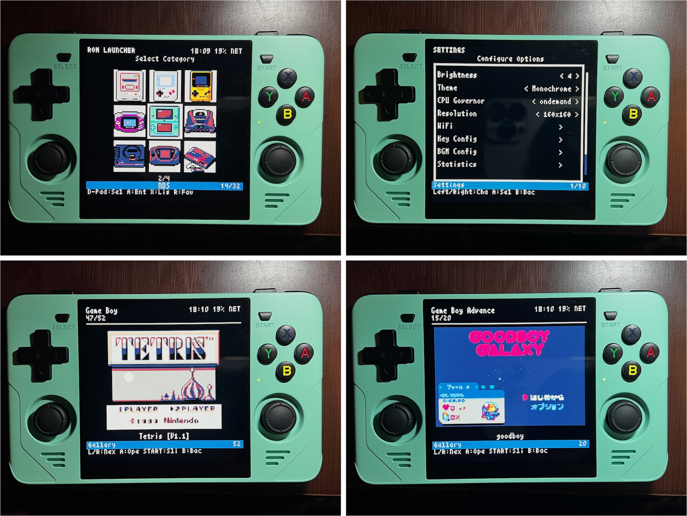
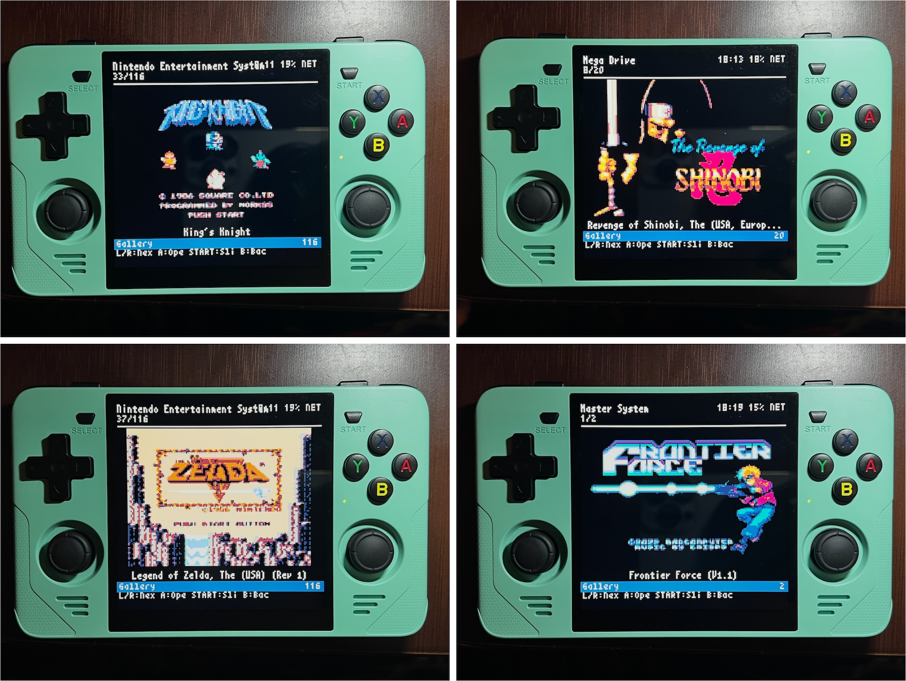

# pyxel frontend for emulator (PFE)

PFEは、Pyxelで構築されたレトロスタイルのROMランチャーです。RetroArchやスタンドアロンエミュレータを外部スクリプト経由で起動し、携帯ゲーム機向けLinux環境でも扱いやすいフロントエンドを目指しています。

  
  

## 主な機能

- ROMカテゴリの一覧表示、ファイル一覧、サブディレクトリ移動
- リスト表示とギャラリー表示
- スクリーンショットプレビューとスライドショー
- お気に入り、最近遊んだゲーム、全カテゴリ検索
- プレイ時間と起動回数の統計
- 日本語表示
- ゲームパッド/キーボードのキーマッピング
- テーマ、画面解像度、BGM、画面輝度などの設定
- バッテリー、ネットワーク、時計の表示
- ROCKNIX上でのPFE/EmulationStation切り替え

## ドキュメント

まず目的に合う文書を読んでください。

| 文書 | 対象 | 内容 |
|------|------|------|
| [INSTALL_JP.md](INSTALL_JP.md) | 通常のLinux/PC利用者 | 依存関係、設定ファイル、起動方法 |
| [docs/ROCKNIX_JP.md](docs/ROCKNIX_JP.md) | ROCKNIX利用者 | Portsからの導入、PFE/ES切り替え、復旧手順 |
| [tools/rocknix/README_JP.md](tools/rocknix/README_JP.md) | ROCKNIXスクリプトを確認する人 | `tools/rocknix` 配下のスクリプト仕様 |
| [docs/ARCHITECTURE_JP.md](docs/ARCHITECTURE_JP.md) | 開発者 | PFE内部構造、設定、画面追加方法 |
| [docs/RELEASE_JP.md](docs/RELEASE_JP.md) | 開発者/配布担当 | 配布前チェック、ROCKNIX向けZIP作成、実機確認 |

ROCKNIX向けの配布ZIPを作る場合は [配布チェックリスト](docs/RELEASE_JP.md) を参照してください。

## 導入

### ROCKNIX

ROCKNIXでは、EmulationStationのPortsからセットアップスクリプトを実行する導入方法を推奨します。

基本の流れ:

1. PFE本体を `/roms/pfe` に配置
2. `tools/rocknix/ports/` の中身を `/roms/ports/` にコピー
3. EmulationStationのPortsから `01_install_pyxel.sh` を実行
4. 続けて `02_install_pfe.sh` を実行してPFE依存関係とサービスを登録
5. PFEへ切り替える場合は `Switch_to_PFE.sh` を実行

詳しい手順は [ROCKNIX導入ガイド](docs/ROCKNIX_JP.md) を参照してください。

### 通常のLinux/PC

依存関係をインストールします。

```bash
./scripts/install_deps.sh
```

設定ファイルを用意します。

```bash
cp data/pfe.cfg.example data/pfe.cfg
```

`data/pfe.cfg` を環境に合わせて編集し、ランチャーを起動します。

```bash
./launcher.sh
```

直接起動もできますが、ゲーム終了後の自動復帰を使う場合は `launcher.sh` を推奨します。

```bash
python3 main.py
```

plumOSなどで専用Pythonを使う場合:

```bash
PFE_PYTHON=/storage/pyxel_Python/bin/python3 ./launcher.sh
```

詳細は [INSTALL_JP.md](INSTALL_JP.md) を参照してください。

## 基本操作

### メインメニュー / ファイル一覧

| 入力 | キーボード | ゲームパッド | 動作 |
|------|------------|--------------|------|
| ナビゲート | ↑/↓ | D-Pad ↑/↓ | カーソル移動 |
| ページ | ←/→ | D-Pad ←/→ | ページアップ/ダウン |
| 決定 | Z / Enter | A | 項目を選択 |
| 戻る | X / Escape | B | 前の画面に戻る |
| 先頭へジャンプ | Q | L | 最初の項目へ移動 |
| 末尾へジャンプ | W | R | 最後の項目へ移動 |
| 表示モード | Aキー | X | リスト/ギャラリーモード切り替え |
| スクリーンショット | Sキー | Y | スクリーンショット切り替え |
| お気に入り | - | START | お気に入り切り替え |
| クイックジャンプ | - | SELECT長押し | ソフトキーボードを開く |

### ギャラリーモード

| 入力 | 動作 |
|------|------|
| ←/→ | 前/次のROM |
| ↑/↓ | 5つジャンプ |
| L/R | 先頭/末尾へジャンプ |
| START | スライドショー切り替え |
| A | ROMを起動 |
| X | リストモードに切り替え |

### 設定画面

| 入力 | 動作 |
|------|------|
| ↑/↓ | 項目を移動 |
| ←/→ | 値を変更 |
| A | サブメニューに入る |
| B | 戻る |

## 設定とカスタマイズ

PFEの基本設定は `data/pfe.cfg` で行います。

主な設定対象:

- ROMのベースディレクトリ
- RetroArchコアパス
- エミュレータ起動スクリプト
- カテゴリ、拡張子、コア
- スクリーンショットディレクトリ
- フォント、テーマ、BGM
- WiFi、明るさ、CPUガバナーなどの外部スクリプト

設定例と詳しい説明は [INSTALL_JP.md](INSTALL_JP.md) と `data/pfe.cfg.example` を参照してください。内部構造や画面追加方法は [docs/ARCHITECTURE_JP.md](docs/ARCHITECTURE_JP.md) にまとめています。

## スクリーンショット

PFEはROM名に対応したスクリーンショットを表示できます。一般的な配置は次の形式です。

```txt
assets/screenshots/<category>/<ROM名>.png
```

ROCKNIXでRetroArchのスクリーンショットをPFEに表示する場合は、[ROCKNIX導入ガイド](docs/ROCKNIX_JP.md) の「PFEゲームとスクリーンショット」を参照してください。

## ディレクトリ構成

主要なファイルとディレクトリだけを示します。

```txt
main.py              PFEのエントリーポイント
launcher.sh          自動再起動付き起動スクリプト
pfe_app/             PFE内部モジュール
ui/                  画面/UIコンポーネント
data/                設定、状態、履歴、ログ
bin/                 エミュレータ起動スクリプト
scripts/             OS連携用スクリプト
assets/              画像、BGM、テーマ、フォント
tools/rocknix/       ROCKNIX向け導入スクリプト
docs/                開発者向け/環境別ドキュメント
```

## トラブル時

まずログを確認してください。

```bash
tail -n 80 data/debug.log
```

ROCKNIX上では次のログを確認します。

```bash
tail -n 80 /roms/pfe/data/debug.log
systemctl status pfe.service --no-pager
```

よくある問題:

- ROMが表示されない: `data/pfe.cfg` のディレクトリ、拡張子、ROM配置を確認
- ゲームが起動しない: `TYPE_RA` や `TYPE_SA_*` のスクリプトパスを確認
- スクリーンショットが表示されない: 画像の配置とROM名の一致を確認
- ROCKNIXでPyxelしか表示されない: [ROCKNIX導入ガイド](docs/ROCKNIX_JP.md) の復旧手順を確認
- PFEが起動しない: `/roms/pfe/pfe_app/` を含めてPFE本体をコピーしているか確認

詳細なトラブルシュートは [INSTALL_JP.md](INSTALL_JP.md) と [docs/ROCKNIX_JP.md](docs/ROCKNIX_JP.md) を参照してください。

## License & Acknowledgments

このプロジェクトのソースコードとオリジナルのBGMファイルは、MITライセンスの下でライセンスされています。

ただし、**このリポジトリに含まれるアイコンアセットはMITライセンスの対象外です**。

PFE uses the following open source projects and materials:

- [**Pyxel**: Retro Game Engine](https://github.com/kitao/pyxel)
- [**Pillow**: Python Image Processing Library](https://pillow.readthedocs.io/en/stable/#)
- [**pygame**: Multimedia Library](https://www.pygame.org/news)
- [**pyxel-universal-font**: Unicode Font Support](https://pypi.org/project/pyxel-universal-font/)
- [**Yoshi-kun's Icon Warehouse**: Various Icons](https://yspixel.jpn.org/)
- [**Retro Game Console Icons**: Various Icons](https://github.com/KyleBing/retro-game-console-icons)

### Icon Assets

このプロジェクトに含まれるアイコンアセットは、それぞれの制作者の財産です。

- これらのアセットは**MITライセンスではありません**
- アイコンアセットの使用、変更、または再配布には、元の制作者の許可が必要になる場合があります
- このプロジェクト以外でこれらのアセットを使用する前に、ライセンスを確認するか、許可を得てください

---
